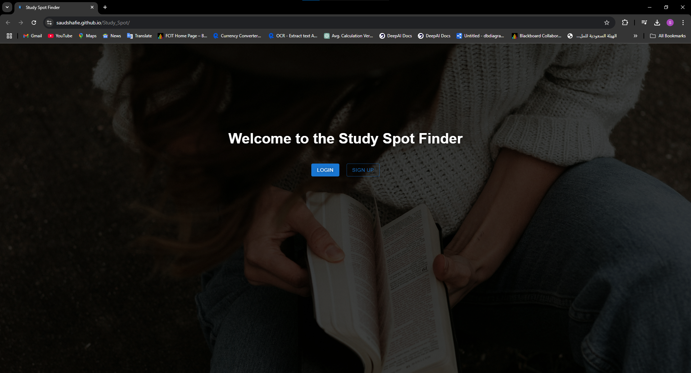
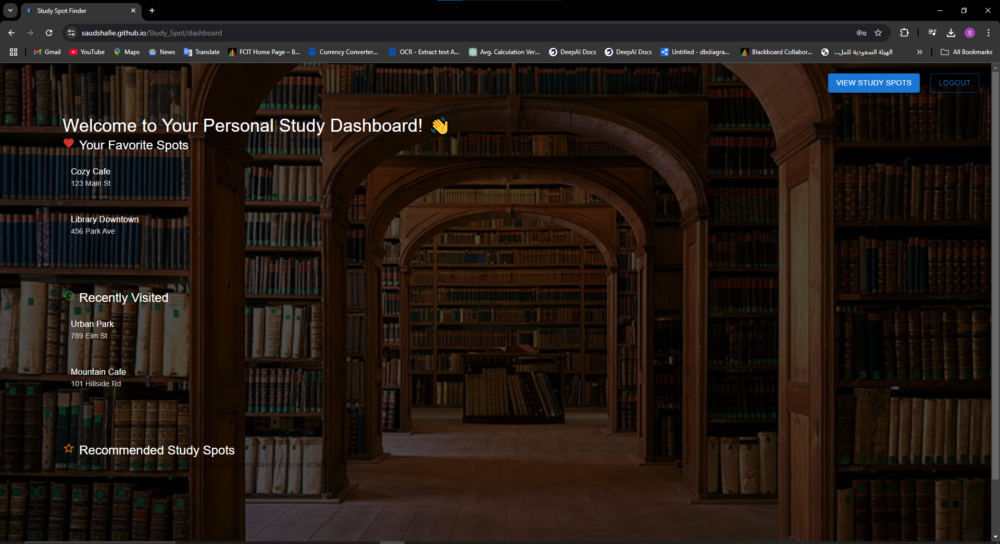
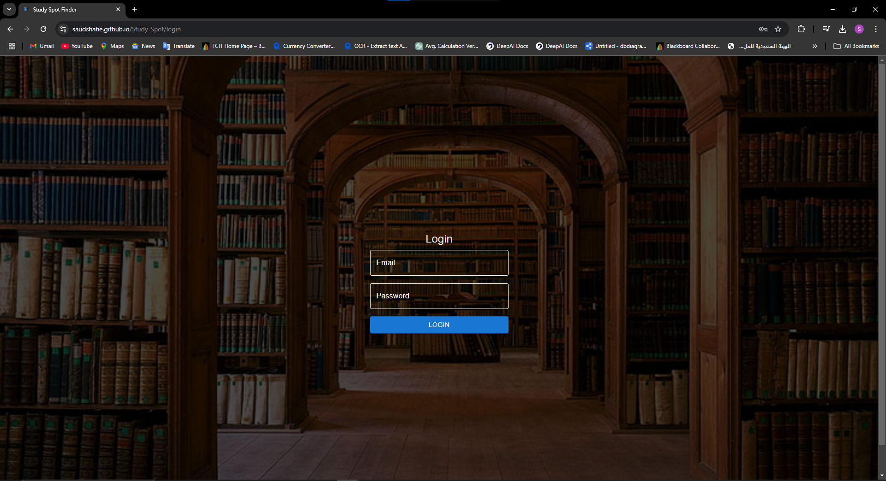

# Study Spots Finder

## Description
The Study Spots Finder is a React application designed to help users find and manage study spots. The app includes features such as user authentication, a dashboard to manage study spots, and a public listing of available spots. It is built with React and uses Vite as the build tool.

## Features
- **Landing Page**: Welcome page with information about the app.
- **User Authentication**: Login and Sign-up functionality.
- **Dashboard**: A protected route where users can manage their study spots.
- **Study Spots Listing**: View a list of available study spots and redirect to Google Map.
- **Protected Routes**: Ensure only authenticated users can access certain pages.

---

## Build Instructions

### Prerequisites
1. Node.js and npm installed on your system.
2. Git installed (optional, if cloning the repository).

### Steps

1. **Clone the Repository**:
   ```bash
   git clone https://github.com/yourusername/Study_Spots.git
   cd Study_Spots
   ```

2. **Install Dependencies**:
   ```bash
   npm install
   ```

3. **Run the Development Server**:
   ```bash
   npm run dev
   ```
   Access the app at [http://localhost:5173](http://localhost:5173).

4. **Build for Production**:
   ```bash
   npm run build
   ```
   This will create a `dist` folder containing the production build.

5. **Preview the Production Build**:
   ```bash
   npm run preview
   ```
   Access the app at [http://localhost:4173](http://localhost:4173).

---

## Folder Structure
```
Study_Spots/
├── public/
│   ├── assets/          # Static assets (e.g., images, icons)
│   ├── vite.svg         # Default favicon
├── src/
│   ├── assets/          # App-specific assets
│   ├── components/      # Reusable components
│   ├── pages/           # Page components
│   ├── App.jsx          # Main app component
│   ├── main.jsx         # Entry point
├── .gitignore           # Git ignore file
├── package.json         # Project metadata and dependencies
├── README.md            # Project documentation
├── vite.config.js       # Vite configuration
```

---

## Screenshots

### Landing Page


### Dashboard


### Login Page


---

## License
This project is licensed under the MIT License. Feel free to use and modify it as needed.

---

## Contributing
Feel free to submit issues and pull requests for improvements or bug fixes!

